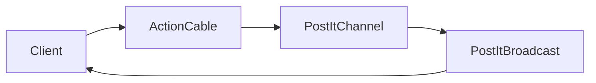

# Architecture 🏗️

## Components

## Key Decisions
1. **Real-time Updates**: ActionCable over polling
2. **Auth**: Devise + WebAuthn for modern auth
3. **DB**: PostgreSQL for relational data

## Directory Structure
- `app/channels/`: ActionCable channels
- `app/controllers/concerns/`: Auth modules
- `app/models/`: Core business logic 