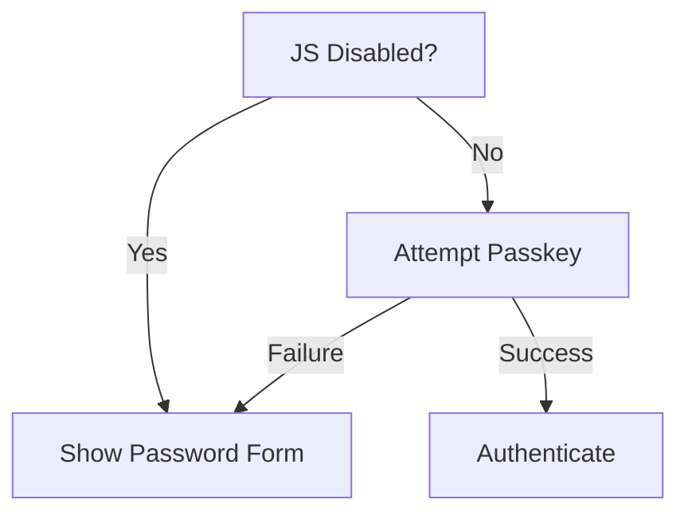

# Authentication Flow 🔐

## Passkey Authentication
1. User initiates registration/login
2. Browser prompts for passkey creation/use
3. Server verifies WebAuthn challenge
4. Session established

## Password Fallback

## Key Models
- `User`: `webauthn_id` (nullable)
- `Passkey`: Stores public keys 